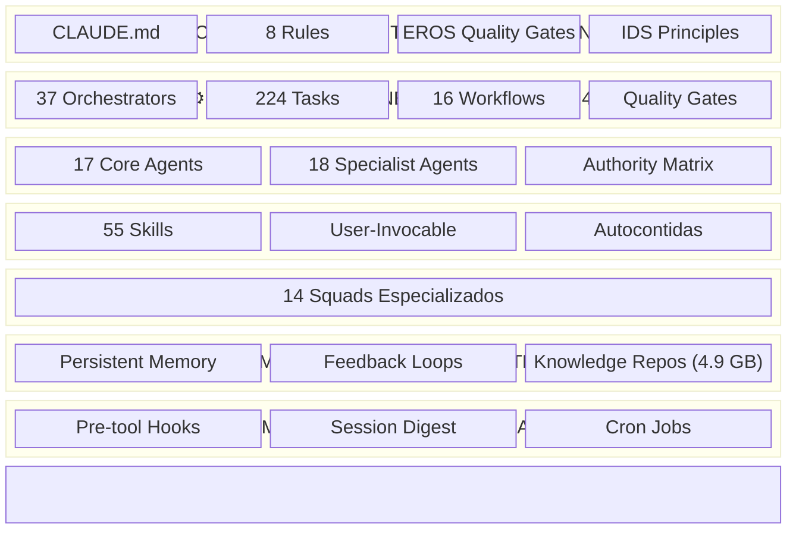
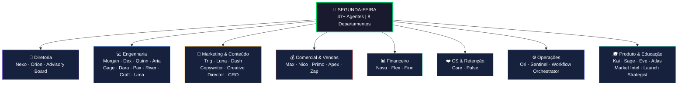
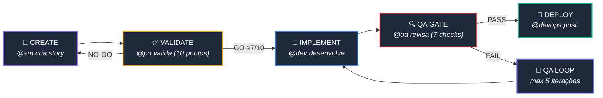
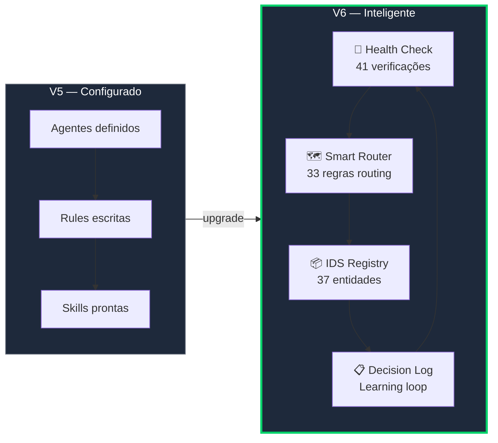

<div align="center">

# Segunda-feira

### 47+ agentes de IA. Um terminal. Uma empresa inteira.

[](https://github.com/DOMINA-IA/segunda-feira/releases)
[](LICENSE)
[](https://docs.anthropic.com/en/docs/claude-code)
[](#agentes-core-commands)
[](#skills-skills)
[](#rules-rules)
[](#v6-intelligence-layer)

---

**Framework de orquestração de agentes de IA para desenvolvimento full-stack e operações de negócio.**

Projetado para [Claude Code](https://docs.anthropic.com/en/docs/claude-code) da Anthropic — transformando um único terminal em uma empresa inteira.

[Instalação](#instalação) · [Arquitetura](#arquitetura) · [Agentes](#o-que-está-incluído) · [V6 Changelog](#changelog)

</div>

---

## Por que o nome

Porque segunda-feira é o dia que todo mundo odeia — mas os agentes amam. Enquanto você toma café, 47 agentes já estão trabalhando.

---

## Arquitetura

O Segunda-feira é organizado em **7 camadas** que se complementam:



---

## Organograma — 8 Departamentos



---

## Story Development Cycle (SDC)

O workflow principal que governa todo desenvolvimento:



**Status:** `Draft` → `Ready` → `InProgress` → `InReview` → `Done`

---

## V6 Intelligence Layer

> A V6 transforma o Segunda-feira de um framework **configurado** para um framework **inteligente**.



| Componente | O que faz | Arquivo |
|-----------|-----------|---------|
| **Health Check** | 41 verificações automáticas — o framework valida sua própria integridade | `scripts/health-check.sh` |
| **IDS Entity Registry** | 37 entidades catalogadas — força REUSE > ADAPT > CREATE | `data/entity-registry.yaml` |
| **Smart Router** | 33 regras de roteamento + 8 colaborações multi-agente | `data/smart-router.yaml` |
| **Architecture Doc** | 1.055 linhas documentando 7 camadas | `docs/architecture.md` |
| **Decision Log** | Template para decisões autônomas — learning loop | `templates/decision-log-template.md` |
| **Workflow Matrix** | 20 workflows com status de maturidade | `docs/workflow-validation-matrix.md` |

<details>
<summary><b>📊 Health Check Output (exemplo)</b></summary>

```
╔══════════════════════════════════════════════════════╗
║   SEGUNDA-FEIRA — FRAMEWORK HEALTH CHECK            ║
╚══════════════════════════════════════════════════════╝

━━━ 1. CONSTITUIÇÃO ━━━
  ✅ CLAUDE.md existe (7978 bytes)
  ✅ Contém referência 'Segunda-feira'
  ✅ Versão detectada: v6.0

━━━ 2. AGENTES ESPECIALISTAS ━━━
  ✅ Total de agentes: 18
  ✅ Todos os agentes têm YAML frontmatter
  ✅ Nenhum agente vazio

━━━ 3. SKILLS ━━━
  ✅ Total de skills: 55
  ✅ Todas as skills têm YAML frontmatter
  ✅ Todas as skills têm campo 'description'
  ✅ Nenhuma skill vazia

━━━ 4. REGRAS DE GOVERNANÇA ━━━
  ✅ Total de regras: 8
  ✅ Todas as regras têm conteúdo
  ✅ Todas as 8 regras esperadas presentes

━━━ 5. SISTEMA DE MEMÓRIA ━━━
  ✅ Total de arquivos de memória: 46
  ✅ Zero links mortos no MEMORY.md
  ✅ Zero arquivos órfãos — todos indexados

━━━ 6. AIOS CORE ENGINE ━━━
  ✅ Versão Synkra: 4.0.4
  ✅ Workflows definidos: 15
  ✅ Tasks executáveis: 228
  ✅ Squads: 13
  ✅ Agentes core: 17
  ✅ IDS Entity Registry presente
  ✅ Smart Router presente
  ✅ Documento de arquitetura presente

━━━ 7. HOOKS E AUTOMAÇÃO ━━━
  ✅ Total de hooks: 4

━━━ 8. REPOSITÓRIOS DE CONHECIMENTO ━━━
  ✅ Grupos INEMA: 28
  ✅ MiroFish repo presente

╔══════════════════════════════════════════════════════╗
║                    RESUMO FINAL                     ║
╚══════════════════════════════════════════════════════╝

  ✅ Passou:    41
  ⚠️  Avisos:   0
  ❌ Falhas:    0
  📊 Total:     41 checks

  SAÚDE DO FRAMEWORK: 100% — EXCELENTE
```

</details>

---

## O que está incluído

### Agentes Core (`commands/`)
38 agentes com personas, comandos e workflows definidos:

<details>
<summary><b>Ver todos os 38 agentes core</b></summary>

| Agente | Role | Modelo |
|--------|------|--------|
| Nexo | Chief of Staff | opus |
| Orion | Master Orchestrator | opus |
| Advisory Board | Conselho Consultivo (11 conselheiros) | opus |
| Morgan | Product Manager | opus |
| Dex | Senior Engineer | sonnet |
| Quinn | Test Architect (QA) | opus |
| Aria | System Architect | opus |
| Gage | DevOps Engineer | sonnet |
| Dara | Data Engineer | sonnet |
| Pax | Product Owner | opus |
| River | Scrum Master | haiku |
| Craft | Squad Creator | sonnet |
| Uma | UX Design Expert | sonnet |
| Trig | Gestor de Tráfego Pago | sonnet |
| Luna | Estrategista de Conteúdo | sonnet |
| Dash | Produtor de Vídeo com IA | sonnet |
| Copywriter | Copy Persuasivo Multi-Canal | sonnet |
| Creative Director | Direção Criativa | sonnet |
| CRO Specialist | Otimização de Conversão | sonnet |
| Max | Gestor Comercial Estratégico | opus |
| Nico | Head de Vendas | sonnet |
| Primo | SDR | haiku |
| Apex | Closer High-Ticket | sonnet |
| Zap | WhatsApp Marketing Specialist | sonnet |
| Nova | CFO | opus |
| Flex | Assistente Financeiro | haiku |
| Finn | Monitor de Plataformas Financeiras | haiku |
| Care | Customer Success | haiku |
| Pulse | CS Retention Specialist | sonnet |
| Ori | Operations Manager | sonnet |
| Sentinel | Operations Monitor | haiku |
| Workflow Orchestrator | Orquestrador Multi-Step | opus |
| Kai | Product Manager (Produtos Digitais) | opus |
| Sage | Mentor Educacional | haiku |
| Eve | Events Manager | haiku |
| Atlas | Business Analyst | sonnet |
| Market Intel | Inteligência Competitiva | opus |
| Launch Strategist | Estrategista de Lançamentos | opus |

</details>

### Agentes Especialistas (`agents/`)
18 agentes com subagent definitions para domínios específicos:

| Agente | Persona | Domínio |
|--------|---------|---------|
| Automation Architect | Wire | n8n, Make, webhooks, pipelines |
| Cold Outreach | Hunter | Prospecção B2B, cold email |
| Growth Hacker | Surge | Algoritmos sociais, crescimento |
| Offer Engineer | Forge | Ofertas irrecusáveis, stack de valor |
| Prompt Engineer | Prism | Prompts avançados, safety |
| RAG Architect | Sage | RAG, vector stores, memória dual |
| Swarm Simulator | Swarm | MiroFish, simulação multi-agente |
| Vibe Coder | Blast | B.L.A.S.T., context engineering |
| Voice AI Specialist | Vox | Voice AI, dublagem, TTS, ASR |
| WhatsApp Specialist | Zap | WhatsApp Bot, automações |
| Advogado do Diabo | — | Análise crítica, riscos, suposições ocultas |
| Mestre do Conselho | — | Conselho deliberativo multi-perspectiva |
| *+ 6 mais...* | | *Copy, Creative, CRO, Launch, Market Intel, Workflow* |

### Skills (`skills/`)

20 skills invocáveis com `/skill-name`:

| Skill | Descrição |
|-------|-----------|
| `/paid-ads` | Gestão de tráfego pago Meta Ads (metodologia Sobral) |
| `/copywriting` | Copy persuasivo — AIDA, PAS, BAB, hooks, CTAs |
| `/launch-strategy` | Estratégia de lançamento digital em 5 fases |
| `/agent-council` | Conselho deliberativo multi-perspectiva |
| `/rag-builder` | Pipelines RAG de produção |
| `/n8n-workflows` | Biblioteca de workflows n8n prontos |
| `/swarm-simulation` | Simulação MiroFish multi-agente |
| `/voice-dubbing` | Pipeline de dublagem 10 etapas |
| `/vps-setup` | Setup VPS Docker completo |
| *+ 11 mais...* | *ad-creative, algorithm-hack, cold-outreach, lead-magnets, offer-optimizer, page-cro, social-content, skill-creator, marketing-psychology, ops-catalog, agent-engineer* |

### Rules (`rules/`)

8 regras que governam o framework:

| Rule | Governa |
|------|---------|
| `workflow-execution.md` | SDC phases, QA Loop, Spec Pipeline, Brownfield Discovery |
| `story-lifecycle.md` | Status progression, validation checklist, QA gate decisions |
| `agent-authority.md` | Delegation matrix — quem pode fazer o quê |
| `ids-principles.md` | REUSE > ADAPT > CREATE hierarchy |
| `coderabbit-integration.md` | Self-healing config, severity handling |
| `external-api-patterns.md` | SYNC > CACHE > REAL-TIME for API integrations |
| `mcp-usage.md` | MCP server governance and tool selection |
| `eros-quality.md` | 5 quality gates, failure taxonomy, proportionality |

---

## Como usar

### Pré-requisitos

- [Claude Code](https://docs.anthropic.com/en/docs/claude-code) instalado
- Node.js 18+
- Git

### Instalação

```bash
# Clone o repositório
git clone https://github.com/DOMINA-IA/segunda-feira.git

# Copie os arquivos para sua configuração Claude Code
cp -r segunda-feira/commands/ ~/.claude/commands/
cp -r segunda-feira/agents/ ~/.claude/agents/
cp -r segunda-feira/skills/ ~/.claude/skills/
cp -r segunda-feira/rules/ ~/.claude/rules/
cp -r segunda-feira/organization/ ~/.claude/organization/
cp segunda-feira/CLAUDE.md ~/.claude/CLAUDE.md

# V6 Intelligence Layer (opcional mas recomendado)
cp -r segunda-feira/scripts/ ~/.claude/scripts/
cp -r segunda-feira/templates/ ~/.claude/templates/
cp -r segunda-feira/data/ ~/.claude/data/
cp -r segunda-feira/docs/ ~/.claude/docs/
```

### Uso básico

```bash
# No Claude Code, ative um agente
@dev           # Ativa o engenheiro sênior
@content       # Ativa a estrategista de conteúdo
@aios-master   # Ativa o master orchestrator

# Use comandos de agente
*help          # Mostra comandos disponíveis
*create-story  # Cria nova story
*task dev-develop-story  # Executa task de desenvolvimento

# Use skills
/paid-ads      # Gestão de tráfego pago
/copywriting   # Copy persuasivo
/launch-strategy  # Estratégia de lançamento

# V6: Health check do framework
bash ~/.claude/scripts/health-check.sh
```

### Personalização

Os agentes usam placeholders que você deve substituir:

| Placeholder | Substitua por |
|------------|--------------|
| `YOUR_COMPANY` | Nome da sua empresa |
| `YOUR_NAME` | Seu nome |
| `@your-handle` | Seu @ do Instagram |
| `your-domain.com` | Seu domínio |
| `YOUR_VPS_IP` | IP do seu servidor |
| `YOUR_PIXEL_ID` | Seu Pixel Meta |
| `YOUR_PAGE_ID` | Seu Page ID Meta |

---

## Estrutura do repositório

```
segunda-feira/
├── README.md
├── CLAUDE.md                              # Constituição v6.0
├── agents/                                # 18 agentes especialistas
├── commands/                              # 38 agentes core + 7 operacionais
├── skills/                                # 20 skills invocáveis
├── organization/                          # 8 departamentos
├── rules/                                 # 8 regras do framework
├── docs/                                  # [V6] Arquitetura + Workflow Matrix
│   ├── architecture.md
│   └── workflow-validation-matrix.md
├── data/                                  # [V6] IDS Registry + Smart Router
│   ├── entity-registry.yaml
│   └── smart-router.yaml
├── templates/                             # [V6] Decision Log
│   └── decision-log-template.md
└── scripts/                               # [V6] Health Check
    └── health-check.sh
```

---

## Metodologias integradas

<table>
<tr>
<td width="50%">

**Desenvolvimento**
- **IDS** — REUSE > ADAPT > CREATE
- **CodeRabbit** — Self-healing de código
- **EROS** — 5 portões de qualidade
- **B.L.A.S.T.** — Context engineering AI-first
- **MiroFish** — Simulação multi-agente

</td>
<td width="50%">

**Marketing & Vendas**
- **Pedro Sobral** — Escala e pausa Meta Ads
- **Alex Hormozi** — Ofertas irrecusáveis
- **Brian Manon** — Creative velocity
- **Motion** — Analytics de criativos
- **SPIN Selling** — High-ticket closing

</td>
</tr>
</table>

---

## Changelog

### V6.0 (2026-03-29) — Intelligence Layer
- Health Check — 41 verificações automáticas de integridade
- IDS Entity Registry — 37 entidades catalogadas
- Smart Router — 33 regras de roteamento + 8 multi-agent collaborations
- Architecture Doc — 7 camadas documentadas (1055 linhas)
- Decision Log Template — Learning loop para decisões autônomas
- Workflow Validation Matrix — 20 workflows com status de maturidade
- +2 agentes: @advogado-do-diabo, @mestre-do-conselho
- +1 regra: EROS Quality Gates
- 100% skills padronizadas com YAML frontmatter

### V5.0 (2026-03-20) — Consolidation
- Sanitização completa, 47 agentes, 20 skills

### V3.0 (2026-03-18) — Foundation
- Release inicial: 38 agentes, estrutura base

---

## Licença

MIT License — use, modifique e distribua livremente.

---

<div align="center">

*Segunda-feira v6.0 — 47+ agentes de IA. 55 skills. 8 rules. Self-healing. O terror do CLT.*

**[DOMINA.IA](https://github.com/DOMINA-IA)**

</div>
