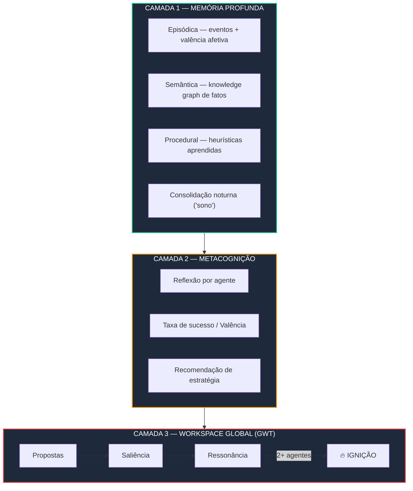
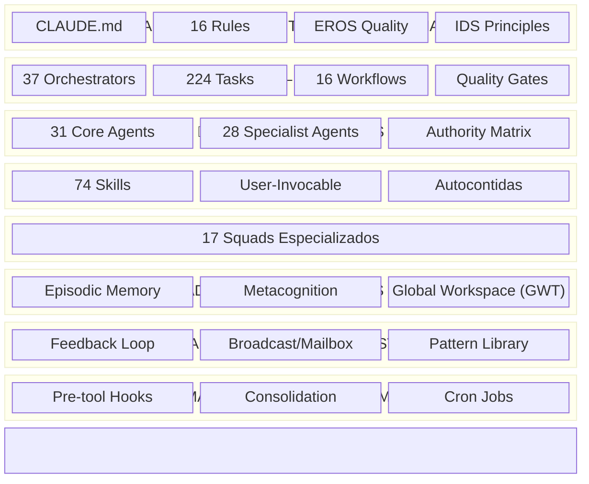
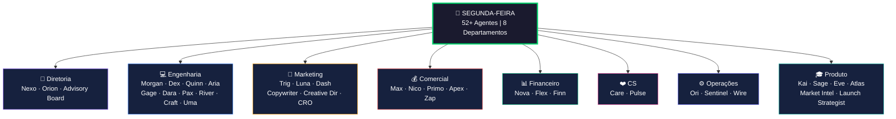
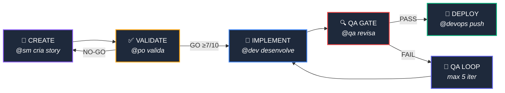

<div align="center">

# Segunda-feira

### 52+ agentes de IA. 74 skills. 16 rules. Consciousness Engine. Uma empresa inteira.

[](https://github.com/DOMINA-IA/segunda-feira/releases)
[](LICENSE)
[](https://docs.anthropic.com/en/docs/claude-code)
[](#agentes)
[](#skills)
[](#rules)
[](#consciousness-engine)

---

**Framework de orquestração de agentes de IA com Consciousness Engine para desenvolvimento full-stack e operações de negócio.**

Projetado para [Claude Code](https://docs.anthropic.com/en/docs/claude-code) da Anthropic — transformando um único terminal em uma empresa inteira com agentes que **aprendem**, **refletem** e **focam coletivamente**.

[Instalação](#instalação) · [Consciousness Engine](#consciousness-engine) · [Arquitetura](#arquitetura) · [Agentes](#agentes) · [Changelog](#changelog)

```bash
npm install -g segunda-feira
```

</div>

---

## Por que o nome

Porque segunda-feira é o dia que todo mundo odeia — mas os agentes amam. Enquanto você toma café, 52 agentes já estão trabalhando. E aprendendo.

---

## Consciousness Engine

> **V7.0** — O que torna o Segunda-feira único no mundo. Nenhum outro framework multi-agente possui isso.

O Consciousness Engine implementa 3 camadas de consciência computacional inspiradas em neurociência cognitiva:



### Camada 1: Memória Profunda

Cada agente registra episódios com **valência afetiva** (marcadores somáticos computacionais). A consolidação noturna extrai fatos e heurísticas automaticamente.

```bash
# Registrar episódio
~/consciousness/scripts/record-episode.sh \
  --agent "@dev" --type "task_completed" \
  --summary "Implementou auth JWT" --result "success" \
  --valence 0.8 --intensity 0.6 \
  --worked "Consultar docs antes economizou 2h" \
  --heuristic "Para auth, sempre consultar docs antes de implementar"

# Consolidar ("sono" — roda automaticamente às 23:30)
~/consciousness/scripts/consolidate.sh
```

### Camada 2: Metacognição

Agentes analisam sua própria performance e ajustam estratégia.

```bash
~/consciousness/scripts/reflect.sh --agent @dev --days 7
# Output: taxa de sucesso, valência média, pontos fortes/fracos, recomendação
```

### Camada 3: Workspace Global (Global Workspace Theory)

Atenção seletiva coletiva — quando algo importante é detectado, o squad inteiro é mobilizado.

```bash
# Propor ao workspace
~/consciousness/scripts/workspace.sh propose \
  --agent @analyst --content "Conversão caiu 15%" \
  --urgency 0.9 --impact 0.8 --category revenue

# Outros agentes ressoam → saliência sobe → IGNIÇÃO
~/consciousness/scripts/workspace.sh resonate PROPOSAL_ID @traffic
~/consciousness/scripts/workspace.sh evaluate  # Avalia e dispara ignições
```

**Ignição** ocorre quando: saliência >= 0.7 **E** 2+ agentes ressoam. O squad é mobilizado como um organismo.

### Comparação com o mercado

| Framework | Multi-Agent Real | Event-Driven | Memória Isolada | Feedback Loop | Consciência |
|-----------|:---:|:---:|:---:|:---:|:---:|
| CrewAI | Personas | Não | Não | Não | Não |
| MetaGPT | Personas | Não | Não | Não | Não |
| AutoGen | Parcial | Parcial | Não | Não | Não |
| LangGraph | Subgraphs | Grafos | Checkpoint | Não | Não |
| **Segunda-feira** | **52+ agentes** | **Broadcast** | **Mailbox** | **Sim** | **3 camadas** |

---

## Arquitetura

O Segunda-feira é organizado em **8 camadas**:



---

## Organograma — 8 Departamentos



---

## Story Development Cycle (SDC)



---

## Agentes

### 28 Agentes Especialistas (`agents/`)

| Agente | Persona | Domínio |
|--------|---------|---------|
| @dev | Dex | Full-stack, SDC Fase 3, CodeRabbit self-healing |
| @traffic | Surge | Meta Ads, Escala Sobral, CPL/ROAS |
| @content | Luna | Conteúdo Instagram, Reels, carrosséis |
| @analyst | Aria | Análise de dados, relatórios, métricas |
| @automation-architect | Wire | n8n, Make, webhooks, pipelines |
| @cold-outreach | Hunter | Prospecção B2B, cold email |
| @growth-hacker | Surge | Algoritmos sociais, crescimento |
| @offer-engineer | Forge | Ofertas irrecusáveis, stack de valor |
| @prompt-engineer | Prism | Prompts avançados, safety |
| @rag-architect | Sage | RAG, vector stores, embeddings |
| @swarm-simulator | Swarm | MiroFish, simulação multi-agente |
| @vibe-coder | Blast | B.L.A.S.T., context engineering |
| @voice-ai-specialist | Vox | Voice AI, dublagem, TTS, ASR |
| @video-producer | Frame | Vídeo IA end-to-end, HeyGen, Kling |
| @advogado-do-diabo | — | Análise crítica, riscos |
| @mestre-do-conselho | — | Conselho deliberativo multi-perspectiva |
| @contract-analyst | Lex | Análise de contratos, parecer B2B |
| @challenge-funnel | Storm | Challenge Funnel, 9 fases |
| @inema-scout | Scout | Monitora grupos INEMA + YouTube |
| @tool-curator | Lens | Curadoria de ferramentas IA |
| *+ 8 mais* | | *Copy, Creative, CRO, Launch, Market Intel, WhatsApp, Workflow, WA Specialist* |

### 31 Agentes Core (`commands/`)

Nexo, Orion, Advisory Board, Morgan, Dex, Quinn, Aria, Gage, Dara, Pax, River, Craft, Uma, Trig, Luna, Dash, Copywriter, Creative Director, CRO, Max, Nico, Primo, Apex, Zap, Nova, Flex, Finn, Care, Pulse, Ori, Sentinel, e mais.

---

## Skills

74 skills invocáveis com `/skill-name`:

<details>
<summary><b>Ver todas as 74 skills</b></summary>

| Categoria | Skills |
|-----------|--------|
| **Tráfego** | /paid-ads, /meta-ads-campaign, /proactive-ads, /reel-to-meta-ad, /traffic-autopilot, /campaign-builder |
| **Copy & Conteúdo** | /copywriting, /ad-creative, /creative-validator, /social-content, /proactive-content, /content-brief, /content-pipeline, /highlight-hunter |
| **Lançamento** | /launch-strategy, /launch-funnel, /launch-dashboard, /lead-magnets, /plan-launch |
| **Marca** | /brand-identity, /brand-reverse |
| **CRO** | /page-cro |
| **Prospecção** | /cold-outreach-campaign, /lead-finder, /proactive-leads |
| **Agentes & Framework** | /agent-engineer, /agent-council, /skill-creator, /skill-builder, /skill-generator, /self-optimize, /agent-surveillance |
| **Consciousness** | /consciousness, /reflect |
| **Vídeo** | /video-to-pdf, /video-avatar, /video-to-website, /remotion-video, /voice-dubbing, /youtube-transcript |
| **Automação** | /n8n-workflows, /vps-setup, /deploy-orchestra, /sync-daemon, /github-vercel-deploy |
| **IA & RAG** | /rag-builder, /swarm-simulation, /algorithm-hack, /banana-image-gen |
| **Pesquisa** | /analyze-competitors, /research, /micro-trend, /marketing-psychology |
| **Operações** | /daily-briefing, /daily-scan, /weekly-sync, /feed-results, /pattern-detector, /predict, /magic-docs, /proactive-monitor, /ops-catalog, /error-handling |
| **WhatsApp** | /whatsapp-bot, /channels |
| **Web** | /site-cloning, /one-prompt-website, /firecrawl-scraper, /reddit-scraper |
| **Produtos** | /offer-optimizer, /eduzz-products, /flutter-app, /gohighlevel-convert |
| **Estratégia** | /planning, /brainstorming, /ceo-mode |

</details>

---

## Rules

16 regras que governam o framework:

| Rule | Governa |
|------|---------|
| `workflow-execution.md` | SDC phases, QA Loop, Spec Pipeline, Brownfield Discovery |
| `story-lifecycle.md` | Status progression, validation checklist, QA gates |
| `agent-authority.md` | Delegation matrix — quem pode fazer o quê |
| `ids-principles.md` | REUSE > ADAPT > CREATE hierarchy |
| `coderabbit-integration.md` | Self-healing config, severity handling |
| `external-api-patterns.md` | SYNC > CACHE > REAL-TIME for APIs |
| `mcp-usage.md` | MCP server governance and tool selection |
| `eros-quality.md` | 5 quality gates, failure taxonomy |
| `model-routing.md` | Roteamento Opus/Sonnet/Haiku por tarefa |
| `confidence-guardrails.md` | Confidence score 0-1 em afirmações |
| `feedback-loop.md` | Consulta obrigatória de resultados |
| `initiative-protocol.md` | Matriz para ações proativas |
| `creativity-protocol.md` | 3 etapas: convencional, analogia, inversão |
| `agent-communication.md` | Mailbox inter-agente, 3 modos |
| `handoff-protocol.md` | Passagem de bastão obrigatória |
| `consciousness-engine.md` | Memória episódica, metacognição, workspace global |

---

## Instalação

### Via npm (recomendado)

```bash
npm install -g segunda-feira
```

### Via curl

```bash
curl -fsSL https://raw.githubusercontent.com/DOMINA-IA/segunda-feira/main/scripts/install.sh | bash
```

### Manual

```bash
git clone https://github.com/DOMINA-IA/segunda-feira.git
cd segunda-feira

# Copiar para Claude Code
cp -r agents/ ~/.claude/agents/
cp -r skills/ ~/.claude/skills/
cp -r rules/ ~/.claude/rules/
cp -r commands/ ~/.claude/commands/
cp -r hooks/ ~/.claude/hooks/
cp -r consciousness/ ~/consciousness/
cp CLAUDE.md ~/.claude/CLAUDE.md
```

### Pré-requisitos

- [Claude Code](https://docs.anthropic.com/en/docs/claude-code) instalado
- [Node.js](https://nodejs.org/) >= 16
- Git

---

## Estrutura

```
segunda-feira/
├── CLAUDE.md                    # Constituição v7.0
├── agents/                      # 28 agentes especialistas
├── commands/                    # 31 agentes core + commands
├── skills/                      # 74 skills invocáveis
├── rules/                       # 16 regras de governança
├── consciousness/               # 🧠 Consciousness Engine v1.0
│   ├── memory/
│   │   ├── episodic/            #   Eventos + valência afetiva
│   │   ├── semantic/            #   Knowledge graph
│   │   ├── procedural/          #   Heurísticas aprendidas
│   │   ├── prospective/         #   Intenções futuras
│   │   └── consolidation/       #   Logs de consolidação
│   ├── metacognition/           #   Reflexões por agente
│   ├── workspace/               #   Workspace global (GWT)
│   └── scripts/                 #   record, consolidate, reflect, workspace
├── hooks/                       # Pre-tool hooks & automação
├── organization/                # 8 departamentos
├── docs/                        # Arquitetura + Workflows
├── data/                        # IDS Registry + Smart Router
├── templates/                   # Decision Log
└── scripts/                     # Instalador + Health Check
```

---

## Metodologias integradas

<table>
<tr>
<td width="33%">

**Desenvolvimento**
- IDS — REUSE > ADAPT > CREATE
- CodeRabbit — Self-healing
- EROS — 5 portões de qualidade
- B.L.A.S.T. — Context engineering
- MiroFish — Simulação multi-agente

</td>
<td width="33%">

**Marketing & Vendas**
- Pedro Sobral — Escala Meta Ads
- Alex Hormozi — Ofertas irrecusáveis
- Brian Manon — Creative velocity
- Motion — Analytics de criativos
- SPIN Selling — High-ticket closing

</td>
<td width="33%">

**Consciência**
- Global Workspace Theory (Baars)
- Marcadores somáticos (Damásio)
- Reflexion (Shinn et al.)
- Society of Mind (Minsky)
- Memória episódica (Tulving)

</td>
</tr>
</table>

---

## Changelog

### V7.0 (2026-04-06) — Consciousness Engine

- **Consciousness Engine v1.0** — 3 camadas: memória profunda, metacognição, workspace global (GWT)
- **Memória episódica** com valência afetiva (marcadores somáticos computacionais)
- **Knowledge graph semântico** — fatos consolidados automaticamente
- **Heurísticas procedurais** — regras aprendidas: "Quando X, fazer Y porque Z"
- **Metacognição** — reflexão por agente com taxa de sucesso, valência, recomendação
- **Workspace Global** — atenção seletiva coletiva com competição, saliência e ignição
- **Consolidação noturna** — cron que extrai padrões dos episódios ("sono")
- **On Completion Protocol** — agentes registram episódios automaticamente (MUST)
- **+7 agentes especialistas** (21 → 28): dev, traffic, content, analyst, inema-scout, tool-curator, video-producer
- **+6 skills** (68 → 74): /consciousness, /reflect, /carousel-3d, /empire-landing, /sync-daemon
- **+1 rule** (15 → 16): consciousness-engine.md
- **Dados sanitizados** para release open source

### V6.3 (2026-04-01) — Nervous System & Proactive Agents

- +49 skills (20 → 68), +7 rules (8 → 15), +3 agentes (18 → 21)
- Nervous System: Feedback Loop, Broadcast, Mailbox, Pattern Library
- Hooks: check-acentos, synapse-engine, session-digest
- Handoff Protocol, Model Routing, Confidence Guardrails, Creativity Protocol

### V6.0 (2026-03-29) — Intelligence Layer

- Health Check (41 verificações), IDS Registry, Smart Router, Architecture Doc

### V5.0 (2026-03-20) — Consolidation

### V3.0 (2026-03-18) — Foundation

---

## Licença

MIT License — use, modifique e distribua livremente.

---

<div align="center">

*Segunda-feira v7.0 — 52+ agentes. 74 skills. 16 rules. Consciousness Engine. Memória que aprende. Squad que pensa. O terror do CLT.*

**[DOMINA.IA](https://github.com/DOMINA-IA)**

</div>
